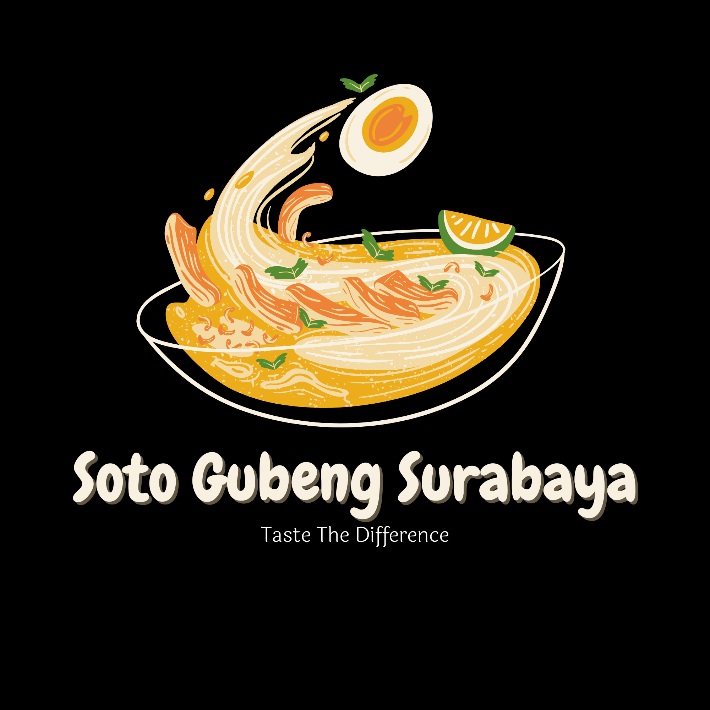
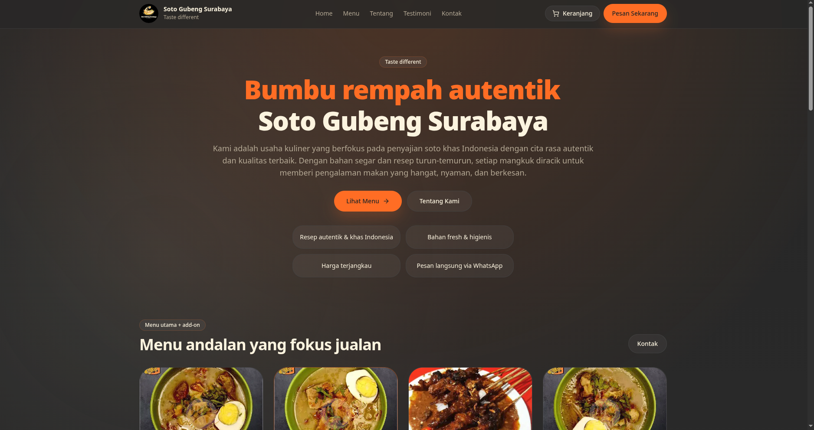
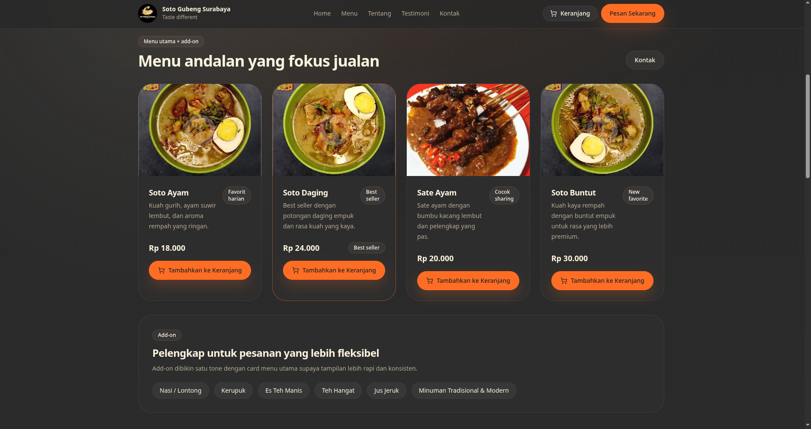
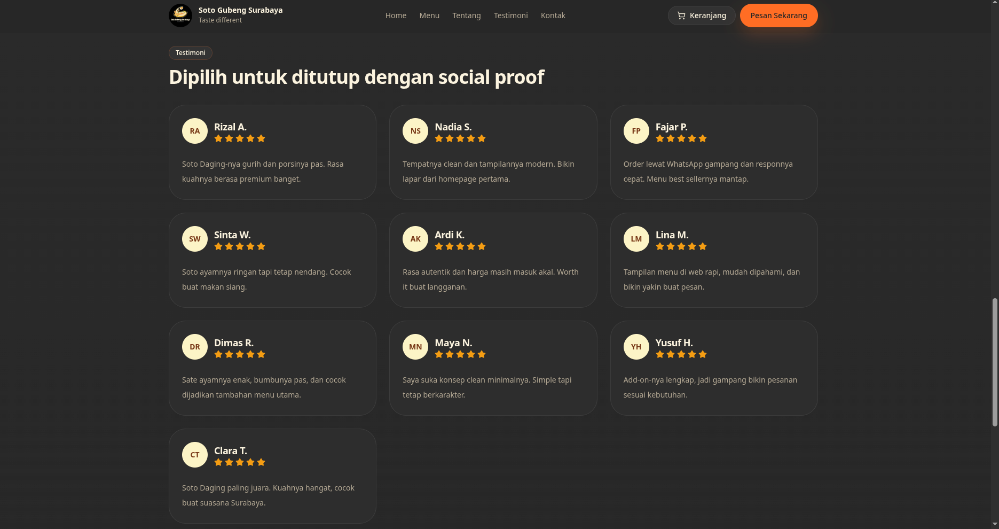

# Soto Gubeng Surabaya

<p align="center">
  
</p>

<p align="center">
  
  
  
  
  
</p>

Modern, mobile-first website for the Soto Gubeng Surabaya brand — built to showcase the menu, highlight testimonials, and make ordering easy through WhatsApp. ✨

## 🔎 Project overview

This repository contains a polished restaurant landing page for **Soto Gubeng Surabaya**. The UI is designed to feel warm, appetizing, and responsive on desktop and mobile.

The current experience includes:
- a sticky brand header
- a hero section with animated headline text
- featured menu cards with product images
- a cart drawer for building an order
- one-click WhatsApp checkout
- about, testimonials, and contact sections

## 📸 Showcase

<p align="center">
  
  
  
</p>

## ⭐ Main features

- Responsive landing page with a strong food-brand visual identity
- Featured menu cards for Soto Ayam, Soto Daging, Sate Ayam, and Soto Buntut
- Cart drawer with quantity controls, remove, and clear actions
- WhatsApp ordering flow that builds a prefilled message from the cart
- Testimonials section for social proof
- Contact section with address, social links, and map embed
- Reusable UI components and clean project structure

## 🧱 Tech stack

- Next.js 14 App Router
- React 18
- TypeScript
- Tailwind CSS 3
- Lucide React icons
- Next/Image for optimized local assets

## 📁 Detailed repository structure

```txt
soto-gubeng-surabaya/
├── app/
│   ├── globals.css            # Global styles
│   ├── layout.tsx             # Root layout
│   └── page.tsx               # Main landing page
├── components/
│   ├── site-header.tsx        # Top navigation and cart button
│   └── ui/                    # Reusable UI primitives
├── lib/
│   ├── site-data.ts           # Brand, menu, testimonials, contact data
│   └── utils.ts               # Shared helpers
├── aset/
│   ├── logo.png               # Brand logo
│   ├── sotogubeng_*.webp      # Menu and showcase images
│   └── contohboilerplate*.png # Extra design references/assets
├── package.json               # Scripts and dependencies
├── README.md                  # Project documentation
├── next.config.mjs            # Next.js config
├── tailwind.config.ts         # Tailwind config
├── postcss.config.mjs         # PostCSS config
└── tsconfig.json              # TypeScript config
```

## 🧑‍💻 Requirements

- Node.js 18+ recommended
- npm
- A modern browser

## ⚙️ Local setup

1. Clone the repository.
2. Install dependencies:

```bash
npm install
```

3. Run the development server:

```bash
npm run dev
```

4. Open the app in your browser at:

```text
http://localhost:3001
```

## 🌍 How to get the repository

### Recommended: git clone

```bash
git clone https://github.com/OWNER/REPO.git
cd REPO
```

### Download with curl

```bash
curl -L -o repo.zip https://github.com/OWNER/REPO/archive/refs/heads/main.zip
unzip repo.zip
cd REPO-main
```

### Download with wget

```bash
wget -O repo.zip https://github.com/OWNER/REPO/archive/refs/heads/main.zip
unzip repo.zip
cd REPO-main
```

## 🪟 Windows setup

Use PowerShell or Windows Terminal.

1. Clone or download the repository.
2. Install dependencies:

```powershell
npm install
```

3. Start the development server:

```powershell
npm run dev
```

4. Open:

```text
http://localhost:3001
```

## 🐧 Linux setup

Works on Ubuntu, Debian, Arch, Fedora, Mint, and other Linux distributions.

1. Clone or download the repository.
2. Install dependencies:

```bash
npm install
```

3. Run the app:

```bash
npm run dev
```

4. Visit:

```text
http://localhost:3001
```

## 🔐 Environment variables

No environment variables are required for the current version of the project.

Project data such as the brand name, menu list, testimonials, and contact details are stored in `lib/site-data.ts`.

Important:

- Do not commit local-only secrets or `.env.local`
- If you later add API keys, keep them in `.env.local`
- Use only public-safe values in client-side code

## 📝 Notes

- The app is currently frontend-only and uses local assets in `aset/`
- The default dev port is `3001` as configured in `package.json`
- Build artifacts like `.next/` and `node_modules/` should stay out of version control

